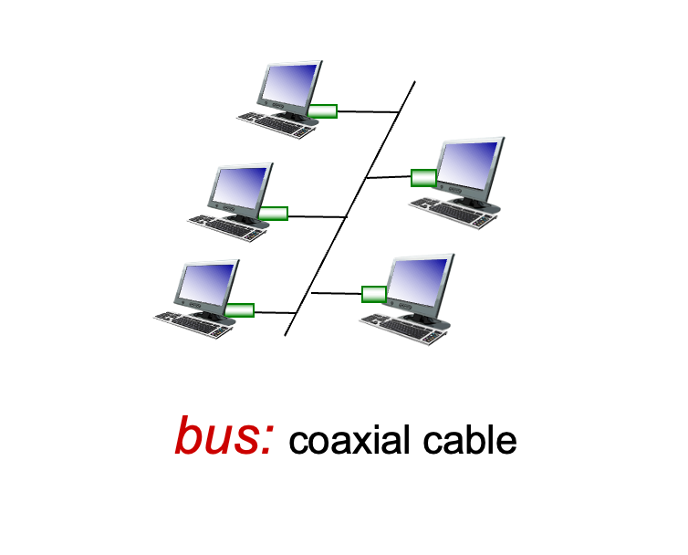
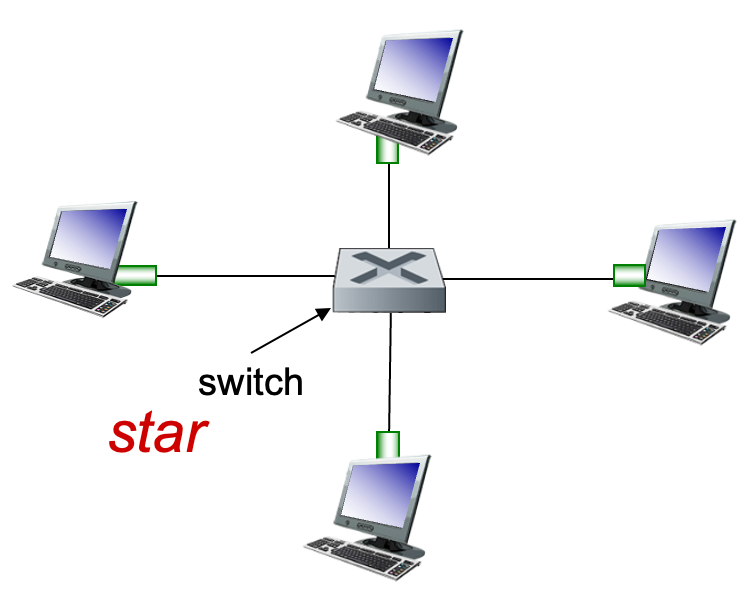

# A Minimum Sim-LAN

This project simulates a simple local area network communication using Python. We provide a `skeleton` file for you. The latest version will be provided at [GitHub](https://github.com/ensomnia16/EE315-24-Proj). Please follow the site to keep up-to-date.

## Changelog

Nov-19: Typo fixes in the document

Nov-28: Test script fixes for `bus` task

Decem-5: Add buffer for `swicth_skeleton`

## Timeline and Presentation

- Task 1&2 is due on *Tuesday, 10:20 on the 16th week*. For Task 1&2, you should upload your code file that contains no other external libraries. Only two `skeleton.py` files are required.
- Task 3 is due on *Thursday, 8:00 on the 16th week.* For Task 3, a function presentation is required in the lab course. You have 2 minutes to demonstrate your functions and how you implement them.

## 40 Points Task 1: A Bus Implementation

In this task, you are required to implement a `bus` LAN.



We provide a `skeleton_bus.py`. Please implement your star LAN based on this file. **DO not modify the following classes**:

- `Bus`
- `Packet`

You have to implement the following classes, but **DO not modify the function signature we provided** in the following classes:

- `Host`

### Example

You can test your code with `test_bus.py`. The grade is only for reference and is not related to the final grade.

## 40 Points Task 2: A Star Implementation

In this task, you are requested to implement a `star` LAN. The topology for `star` LAN refers to the slides provided for LAB courses.



We provide a `skeleton_switch.py`. Please implement your star LAN based on this file. **DO not modify the following classes**:

- `SwitchFabric`
- `Packet`

You have to implement the following classes, but **DO not modify the function signature we provided** in the following classes:

- `Host`
- `Switch`

### Example

You can test your code with `test_swtich.py`. The grade is only for reference and is not related to the final grade.

## 20 + 10 Points Task 3 A More-complex Sim-LAN

In this task, you have to implement a more complex sim-LAN.

Implement two of the following functions to gain your last 20 points:

- VLAN
- Encrypted Packets
- Modulation/Demodulation
- Router
- Switch table update when interface/MAC changes
- ... you may refer to the course group to check if your own functions (that are not listed above) are valid.

Implement another function (feel free to choose, based on the code we provided and you implemented) to get additional 10 points. The total point will not exceed 100.

## Additional Tips

You cannot use any other libraries when implementing Task 1 and Task 2. You have to keep a minimum implementation (coutains no other external libraries) for us to check Task 1 and Task 2.

For Task 3, feel free to use helpful external libraries, but you can directly use external libraries to implement functions.

Files we provided:

```
--proj
----ee315_24_lib.py
----skeleton_bus.py
----skeleton_switch.py
----test_bus.py
----test_switch.py
```
